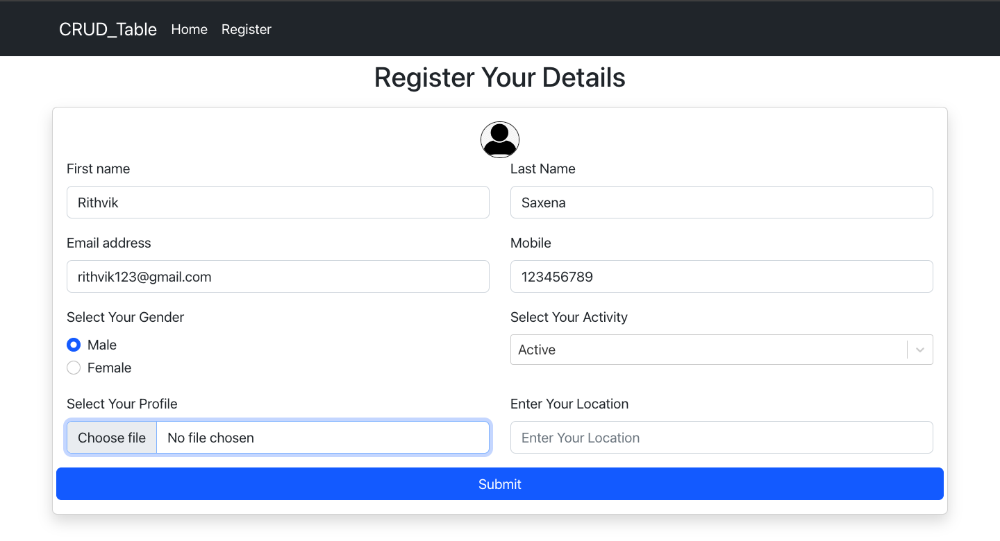
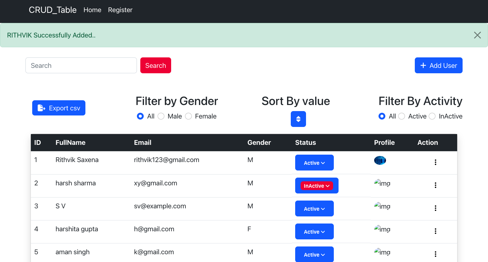
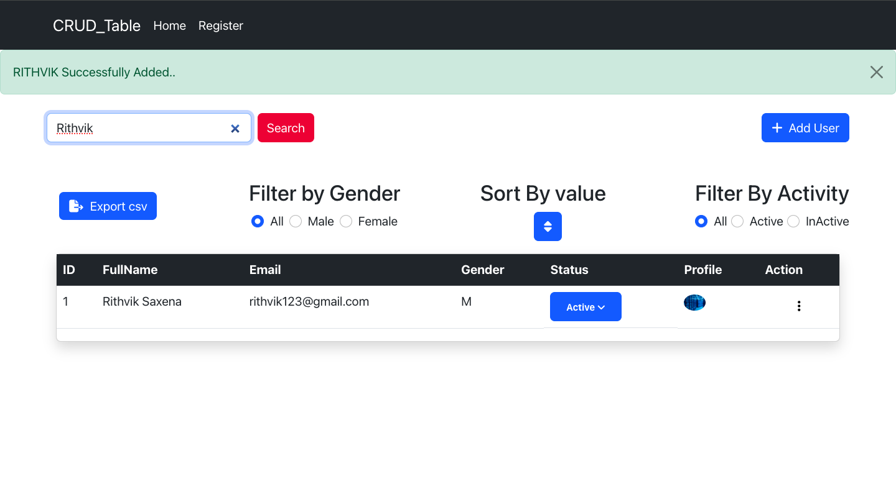
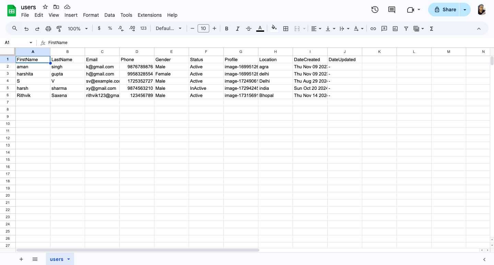

# InfoMaestro

#### InfoMaestro is a powerful and versatile CRUD (Create, Read, Update, Delete) application designed to streamline employee information management. Whether you're managing a small team or a large organization, InfoMaestro provides an all-in-one solution to keep your employee data organized, accurate, and accessible.

## **Key Features** :
- **Employee Management:** Add, view, update, and delete employee records.
- **Search & Filter:** Quickly find employees using various filters.
- **CSV Export:** Download employee data in CSV format for offline access.
- **Add New Employee:** Easily register new employees with detailed profiles.
- **Role-Based Access Control:** Secure your data with customizable user roles.
- **Responsive Design:** Works seamlessly on all devices.
- **Real-Time Updates:** Automatically reflect changes across the application.
- **Data Validation:** Ensure data integrity with form validation.

## Tech Stacks Used :

## **Installation & Getting Started** :

1. Clone repository: **`git clone https://github.com/username/InfoMaestro.git`**
2. Navigate the directory: **`cd InfoMaestro`**
3. Install dependencies: **`npm install`**
4. Configure environment variables: Create a .env file in the project root: **`DATABASE_URL=mongodb://localhost:27017/infomaestro
PORT=3000
JWT_SECRET=your_secret_key`**
5. Start the application: **`npm start`**

## **Usage** :

**1. Add New Employee**
Navigate to the "Add Employee" section.
Fill out the form with the required details and submit.
**2. Manage Employees**
View, update, or delete employee records directly from the dashboard.
**3. Export Employee Data**
Click on the Export to CSV button to download employee data.

## **Who Can Benefit from InfoMaestro?**

- **Human Resource Teams:** Manage employee data efficiently and generate reports.
- **Managers and Team Leads:** Track team member details and performance.
- **IT Administrators:** Oversee system access and security.
- **Educational Institutions:** Maintain detailed records of staff.

<h3 align="center">User Registration</h3>

<h3 align="center">Home Status</h3>

<h3 align="center">Search User</h3>

<h3 align="center">Export CSV File</h3>

